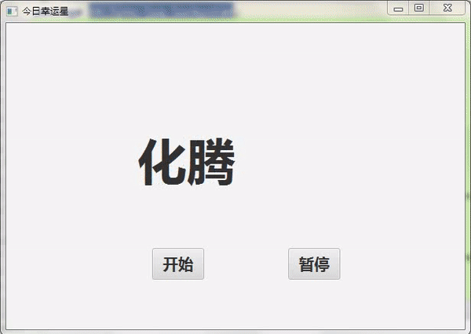

# LuckyStarJDK8
LuckyStarJDK8（今日幸运星，基于Java FX实现的用于课堂抽取学生答题的桌面程序）

项目基于IntelliJ IDEA开发。（还有一个功能相同，但基于PowerPoint 2013的VBA版本，见LuckyStar项目）

----
- 编译方法：

Git Clone后，导入IDEA，找到cn.lynu.lyq.luckystar.Main的类，编译运行。

----
- 运行方法：
将releases目录中的三个文件（LuckyStar.jar, students.xlsx, run.bat）解压或复制到同一目录，
双击run.bat，即可。

其中，students.xlsx是学生姓名数据的模板文件，可以修改。

学号无所谓，将姓名从第二行开始放到Excel 文件的第一个工作表的第2列上。

----
- 运行截图：

